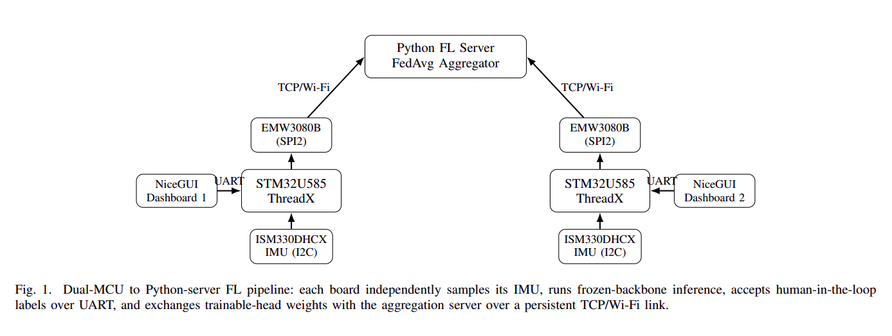

# On-Device Federated Learning for Human Activity Recognition

Two STM32U585 microcontrollers train a shared activity-recognition model
collaboratively over Wi-Fi — no cloud, no raw sensor data ever leaving
either device. Only a 224-byte parameter update is exchanged per round.

**Status:** research prototype. Core FL loop (local training → Wi-Fi
exchange → FedAvg → redistribution) is validated end-to-end on physical
hardware across multiple rounds.

## Contents
- [Overview](#overview)
- [Architecture](#architecture)
- [Repository Structure](#repository-structure)
- [Hardware Requirements](#hardware-requirements)
- [Quick Start](#quick-start)
- [Documentation](#documentation)
- [Acknowledgments](#acknowledgments)
- [Demo Video](#demo-video)

## Overview

Each board runs a hybrid model: a frozen, quantized convolutional backbone
(`st_ign_wl_48`, from [ST's model zoo](https://github.com/STMicroelectronics/stm32ai-modelzoo))
turns a 48-sample accelerometer window into a 12-dimensional embedding,
combined with a gyroscope-magnitude feature into a 13-dimensional vector
fed to a small **trainable linear head** — 4 classes
(`Jogging`, `Stationary`, `Stairs`, `Walking`) × 13 features + 4 biases,
56 parameters total.

The head is trained **on the device**, in place, via closed-form softmax
cross-entropy SGD — no autodiff, no stored activations — triggered by
human-in-the-loop gesture labels sent from a browser dashboard over UART.
Each board periodically exchanges its 224-byte parameter vector with a
Python aggregation server over a persistent TCP socket (Azure RTOS
ThreadX + NetX Duo on the MCU side), running a lockstep Federated
Averaging protocol.

## Architecture

  

## Repository Structure

```
fl/
├── Core/
│   ├── Inc/trainable_head.h       # Trainable linear head interface
│   └── Src/
│       ├── main.c                # Peripheral init, UART RX priming
│       ├── app_threadx.c         # Sensor thread, command parser, mutexes
│       └── trainable_head.c      # On-device linear head + SGD
├── AZURE_RTOS/App/               # ThreadX application setup
├── NetXDuo/App/app_netxduo.c     # FL TCP client (App_SNTP_Thread_Entry)
├── AI_Runtime/                   # ST Edge AI models and runtime headers
│   ├── st_ign_wl_48.keras        # Original pretrained model
│   └── Inc/
├── HAR/
│   ├── AI/                       # Generated full-model C code
│   └── AI_EMBED/                 # Generated frozen-backbone C code with final head removed
├── Auxiliary/
│   ├── slice_model.py            # Cuts the Keras model at the dense layer
│   ├── generate_baseline.py      # Extracts baseline head weights
│   └── EMW3080update_*.bin      # Wi-Fi module firmware update image
├── build/Debug/                 # CMake build output, including the ELF
├── Drivers/, Middlewares/        # STM32, ThreadX, and NetX Duo dependencies
├── CMakeLists.txt, CMakePresets.json
├── fl.ioc                       # STM32CubeMX project configuration
├── server/
│   ├── protocol.py              # Wire format + socket helpers
│   ├── aggregate.py             # FedAvg math
│   ├── server.py                # FL aggregation server
│   ├── fake_client.py           # Simulated board, for testing without hardware
│   ├── flaky_client.py          # Simulated dropped-connection test
│   ├── bridge.py / serial_io.py # UART<->TCP bridge (superseded, see §8.3)
│   └── checkpoints/              # Saved global models per round
└── dashboard/
    ├── main.py                  # NiceGUI dashboard
    ├── backend.py               # Abstract transport interface
    └── uart_backend.py          # pyserial transport
```

## Hardware Requirements

- 2× STMicroelectronics **B-U585I-IOT02A** Discovery Kits (onboard
  ISM330DHCX IMU, MXCHIP EMW3080B Wi-Fi module, ST-LINK V3)
- A host machine with a Wi-Fi adapter capable of 2.4 GHz AP (hotspot) mode

## Quick Start

Full setup (CubeMX configuration, ST Edge AI pipeline, EMW3080 firmware,
build/flash workflow) is in **[PROJECT_GUIDE.md](Auxiliary/docs/PROJECT_GUIDE.md)** — this
is the condensed happy path once everything's already built and flashed.

```bash
# 1. Bring up the host hotspot
nmcli con up lab-hotspot

# 2. Start the FL server BEFORE touching the boards
python3 server.py --num-clients 2 --num-rounds 2 --init-weights checkpoints/baseline_weights.bin

# 3. Start both dashboards, using persistent serial paths
uv run main.py /dev/serial/by-id/usb-STMicroelectronics_STLINK-V3_<SN1>-if02 8080
uv run main.py /dev/serial/by-id/usb-STMicroelectronics_STLINK-V3_<SN2>-if02 8081

# 4. Reset both boards to trigger connection to server. (physical button or a reflash)
```
Then use each dashboard's label buttons to correct live predictions
against the gesture you're performing, click **Finish Round** when done,
and repeat once the server broadcasts the next round's global model.

## Documentation

- **[PROJECT_GUIDE.md](PROJECT_GUIDE.md)** — full reproduction guide:
  CubeMX peripheral setup, the ST Edge AI model pipeline, the complete
  wire protocol, every UART command, and a symptom-indexed troubleshooting
  section covering every failure mode hit while building this (TCP
  fragmentation over the SPI-bridged Wi-Fi link, USB device renumbering,
  a missing NVIC interrupt enable, and more).
- **`Edge_Native_Federated_Learning__Synchronized_On_Device_Training_and_Real_Time_Inference_on_Dual_ARM_Cortex_M33_Microcontrollers.pdf`** — a short IEEE-format writeup of the system
  architecture, training formulation, and empirical convergence results,
  if you want a citable, condensed technical summary instead of the full guide.

## Acknowledgments

- Backbone model: [ST's STM32 AI model zoo](https://github.com/STMicroelectronics/stm32ai-modelzoo),
  trained on the [WISDM](https://www.cis.fordham.edu/wisdm/dataset.php) activity-recognition dataset.
- Networking baseline adapted from ST's `Nx_SNTP_Client` Azure RTOS example.
- FedAvg: McMahan et al., *"Communication-Efficient Learning of Deep
  Networks from Decentralized Data"*, AISTATS 2017.

## Demo Video
Find demo video [here](Auxiliary/docs/demo-video.mkv)  
  
**Breakdown**
- MCUs connected
- Dashboards started
- Server Started
- MCUs connect to server (triggered by RESET button)
- Server broadcasts the initial model to the two MCUs
  - *Note: for demo purposes, the broadcasted model in this demo has a zero-initialized head--rather than the actual head inherited from the frozen backbone--in order to see a noticeable effect of FL within a few rounds. So initially, the model assigns equal predictions to all classes (25%).*
- Each MCU trains on a different task (e.g. MCU A trained on "stationary" activity, MCU B trained on "jogging")
- After one round of FL, both MCUs get the updated model, and can be seen to have the same predictions for a given activity
  - MCU A, trained only on "stationary" state, can now recognize "jogging" with a higher probability, and vice versa